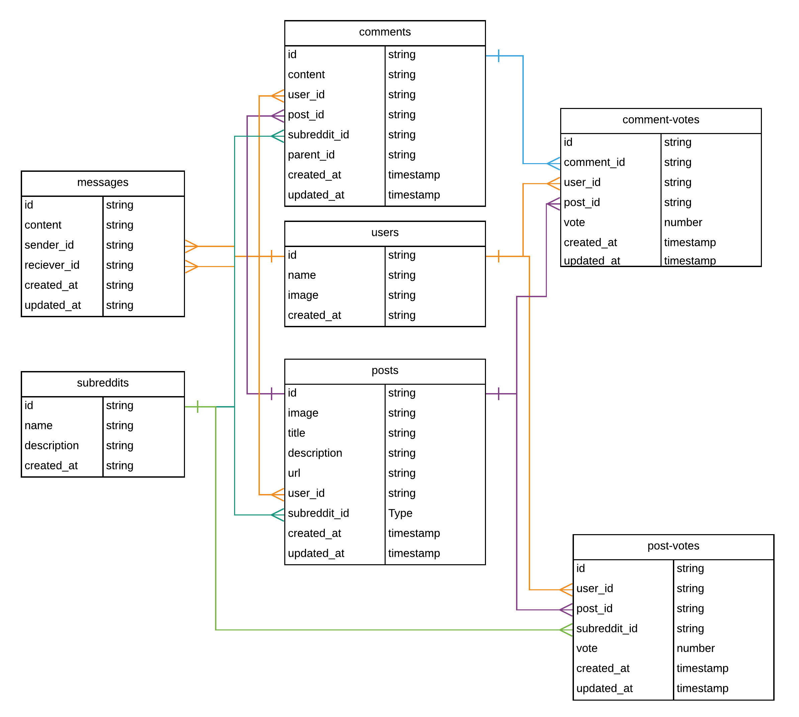

# Full Stack Reddit Clone with Firebase Firestore, Vue.js/Vuex, Bulma

* [x] Generate Vue App
* [x] Create Firebase Project
  * [x] STRICT RULES
* [x] Add Firebase Auth
  * https://firebase.google.com/docs/auth/web/google-signin
  * https://firebase.google.com/docs/auth/web/manage-users
    * Save user on login
      * [x] Update Rules
* [x] Add VuexFire
  * https://github.com/posva/vuexfire/tree/firestore
* [x] Add a few subreddits in Firestore
  * general
  * javascript
  * learn-programming
  * pics
  * funny
* [x] Show Subreddits on Home Page
* [x] Show Single Subreddit
* [x] New Post Form
  * Update Rules
* [x] Display Posts on Subreddit Page
  * Types: Image/Text/Url

## Extra
* [x] Hide submit form if not logged in
* [x] Show Usernames
* [x] Show User Images
* [x] Format Dates
* [x] Fix card formatting
* [x] Search/Filter Posts
* [ ] UpVote/DownVote Posts
  * Update Rules
  * [ ] Order by total score
  * [ ] Order by created
* [ ] Add comment to Post
  * Update Rules
* [ ] User Profile
  * [ ] Show Submitted Posts
  * [ ] Show UpVoted Posts
  * [ ] Show Comments
* [ ] Edit Post
* [ ] Edit Comment
* [ ] UpVote/DownVote Comment
* [ ] Reply to Comment
* [ ] Display Error Image if bad link/error
* [ ] Cloud Function Score Aggregator
  * https://firebase.google.com/docs/firestore/solutions/aggregation#solution_cloud_functions
* [x] Delete Post
  * [ ] Cloud Function "Cascade Delete" comments
* [ ] Upload Images to Firebase storage

## Resources

* https://angularfirebase.com/tag/firestore/

